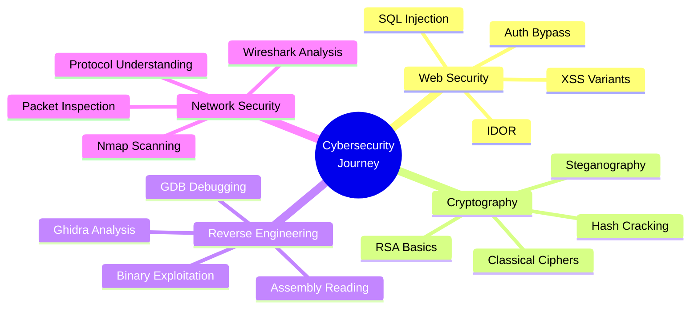

<div align="center">

<!-- Header Banner -->


<!-- Typing Animation -->
<p>
  
</p>

<!-- Badges Row -->
<p>
  
  
  
</p>

</div>

---

##  About Me

```python
class CybersecurityStudent:
    def __init__(self):
        self.name = "Glenvio Regalito Rahardjo"
        self.role = "Vocational Cybersecurity Student"
        self.school = "SMK Telkom Purwokerto"
        self.major = "Computer Network & Telecommunications (TJKT)"
        self.grade = 11
        self.location = "Purwokerto, Indonesia"
        
    def current_mission(self):
        return {
            "learning": ["Web Security", "Cryptography", "Reverse Engineering"],
            "practicing": "Daily CTF challenges & hands-on labs",
            "seeking": "PKL Internship in Yogyakarta (Cybersecurity)",
            "mindset": "Learning by doing, one vulnerability at a time"
        }
    
    def get_status(self):
        return "🎯 Building foundations through CTF | 🔐 Exploring security fundamentals"

student = CybersecurityStudent()
print(student.get_status())
```

<div align="center">

### 🎯 Current Focus



</div>

---

## 🏆 Achievements & Competition History

<div align="center">

### 🥇 2025 Competition Results

<table>
<tr>
<td align="center" width="33%">


**🥉 LKS Keamanan Siber**  
*Tingkat Kabupaten Banyumas*

**3rd Place** | 2025  
IT Network Systems Administration  
Cybersecurity Competition

</td>
<td align="center" width="33%">


**🥈 Piala Gubernur 2025**  
*Cyber Security Competition*

**Top 10 Finalist**  
Attack & Defense CTF  
Patching Specialist

</td>
<td align="center" width="33%">


**🏅 CSSC Amikom YK**  
*Cyber Security School Competition*

**Top 21**  
Regional High School CTF  
Problem Solving Under Pressure

</td>
</tr>
</table>

### 🎯 National Level Participation

| Event | Type | Role | Year |
|-------|------|------|------|
| **Cyber Jawara 2025** | National CTF | Team Member | 2025 |
| Focus Areas | Web Exploitation & Cryptography | Active Participant | - |

</div>

---

## 🛠️ Technology Arsenal

<div align="center">

### Operating Systems


### Programming & Scripting


### Security Toolkit

**Web Application Testing**  


**Network Analysis**  


**Reverse Engineering**  


**Cryptography & Forensics**  


</div>

---

## 📊 Learning Progress

<div align="center">

```ascii
┌─────────────────────────────────────────────────────────────┐
│  📈 SKILL DEVELOPMENT JOURNEY                               │
├─────────────────────────────────────────────────────────────┤
│                                                             │
│  Web Application Security    ████████░░░░  60%             │
│  Network Security            ███████░░░░░  55%             │
│  Cryptography               ██████░░░░░░  50%             │
│  Reverse Engineering        █████░░░░░░░  45%             │
│  Linux Administration       ████████░░░░  65%             │
│  Python Scripting           ███████░░░░░  58%             │
│                                                             │
│  🎯 Focus: Consistent daily practice & CTF participation    │
└─────────────────────────────────────────────────────────────┘
```

### 📚 Learning Resources

<table>
<tr>
<td align="center"><b>Platforms</b></td>
<td>picoCTF • HackTheBox • TryHackMe • OverTheWire</td>
</tr>
<tr>
<td align="center"><b>Documentation</b></td>
<td>OWASP Top 10 • CWE/CVE Database • CTF Writeups</td>
</tr>
<tr>
<td align="center"><b>Community</b></td>
<td>YouTube Tutorials • Security Blogs • Discord Servers</td>
</tr>
</table>

</div>

---

## 💼 PKL Internship Objective

<div align="center">

### 🎯 Seeking Professional Experience


</div>

```yaml
internship_profile:
  position: "PKL Cybersecurity Intern"
  location: "Yogyakarta, Indonesia"
  period: "2026-2027 Academic Year (Grade 12)"
  
  preferred_sectors:
    - Penetration Testing Firms
    - Security Operations Center (SOC)
    - Cybersecurity Consulting
    - IT Security Departments
  
  what_i_bring:
    technical_skills:
      - Web Application Security Fundamentals
      - Network Security Knowledge
      - CTF Problem-Solving Experience
      - Linux System Administration
    
    soft_skills:
      - Self-directed Learning Discipline
      - Team Collaboration (CTF Competitions)
      - Professional Communication
      - Eagerness to Learn from Mentors
    
    achievements:
      - LKS Cybersecurity 3rd Place (Regional)
      - Multiple CTF Competition Finalist
      - Consistent Hands-on Practice Record
  
  learning_goals:
    - Real-world security operations exposure
    - Industry-standard tool proficiency
    - Professional workflow understanding
    - Mentorship from experienced professionals
    
  availability: "Ready to contribute and learn"
```

<div align="center">

**💡 I understand I'm entering as a learner, not an expert.**  
*Ready to work hard, ask smart questions, and grow professionally.*

</div>

---

## 📁 Repository Overview

<div align="center">

### 🗂️ What You'll Find Here

</div>

<table>
<tr>
<td width="50%">

**🎓 Learning Projects**
- CTF writeups & methodology
- Vulnerable lab environments
- Security tool automation scripts
- Self-study documentation

</td>
<td width="50%">

**🔧 Current Work**
- OWASP Top 10 practice labs
- Exploitation & remediation docs
- Python security utilities
- Challenge solution archives

</td>
</tr>
</table>

<div align="center">

```
┌──────────────────────────────────────────┐
│  📌 Repository Philosophy                │
├──────────────────────────────────────────┤
│                                          │
│  This is my learning journal, not a     │
│  showcase of mastery. Every commit      │
│  represents progress, practice, and     │
│  persistence in building cybersecurity  │
│  fundamentals.                          │
│                                          │
│  🚀 Focus: Progress over Perfection     │
└──────────────────────────────────────────┘
```

</div>

---

## 📈 GitHub Statistics

<div align="center">


</div>

---

## 🎯 Learning Philosophy

<div align="center">

```ascii
╔═══════════════════════════════════════════════════════════╗
║                                                           ║
║   "I don't know everything. I'm not trying to."          ║
║                                                           ║
║   My focus:                                              ║
║   ✓ Learning consistently every day                      ║
║   ✓ Building fundamentals properly                       ║
║   ✓ Documenting progress publicly                        ║
║   ✓ Getting 1% better daily                             ║
║                                                           ║
║   The goal isn't to be the best.                         ║
║   The goal is to be better than yesterday.               ║
║                                                           ║
╚═══════════════════════════════════════════════════════════╝
```

### 📖 5 Core Principles

<table>
<tr>
<td align="center" width="20%">

<br><b>Hands-On First</b>
<br><sub>Learn by doing</sub>
</td>
<td align="center" width="20%">

<br><b>Document All</b>
<br><sub>Writing reinforces</sub>
</td>
<td align="center" width="20%">

<br><b>Fail Forward</b>
<br><sub>Mistakes = lessons</sub>
</td>
<td align="center" width="20%">

<br><b>Ask Questions</b>
<br><sub>No stupid questions</sub>
</td>
<td align="center" width="20%">

<br><b>Stay Consistent</b>
<br><sub>Daily progress</sub>
</td>
</tr>
</table>

</div>

---

## 📬 Connect With Me

<div align="center">

### 🌐 Let's Collaborate!

<p>
  <a href="mailto:glenviorahardjo29@gmail.com">
    
  </a>
</p>

<p>
  <a href="https://linkedin.com/in/glenvio-regalito-rahardjo-2784ba387">
    
  </a>
</p>

<p>
  <a href="https://github.com/rahardjo-glenvio">
    
  </a>
</p>

```
┌────────────────────────────────────────┐
│  💼 Open for PKL Opportunities         │
│  🤝 Available for Collaboration        │
│  ⚡ Response Time: Within 24 hours     │
└────────────────────────────────────────┘
```

</div>

---

<div align="center">

### 💭 Final Words

*"This repository represents my journey, not my destination."*

**Every commit is a step forward.**  
**Every challenge is a lesson.**  
**Every mistake is an opportunity to improve.**

 **Currently learning and growing** 

---


<sub>🔐 Passionate about cybersecurity | 🎯 Focused on growth | 💼 Seeking PKL in Yogyakarta | 📫 Always open to connect</sub>

<br>

**Made with 💙 by Glenvio Rahardjo**  
*Last Updated: May 2025*

</div>
