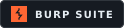
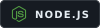
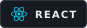

  
  
  
  

<i>"Though this be madness, yet there is method in't."</i> &nbsp;·&nbsp; Hamlet, Act II

## I. The Subject

  

 

Grade XII student at **SMK Telkom Purwokerto** (TJKT, Cyber Security track). I spend most of my time breaking web apps in legal labs, reporting real vulnerabilities through responsible disclosure, and building blue team tooling on the side so I understand both sides of the fight.

Still learning. Still getting things wrong. But consistent, and every case gets documented.

## II. Field Records

**Independent Security Researcher** &nbsp;·&nbsp; Responsible Disclosure &nbsp;·&nbsp; `Jun 2026 to present`

- Found and reported vulnerabilities through coordinated disclosure to **RiauCSIRT, BandungCSIRT, CimahiCSIRT** and **BMKG-CSIRT**.
- Wrote technical reports to support verification and remediation, keeping sensitive details out of every public post.
- Public proof: [BMKG-CSIRT](https://www.linkedin.com/feed/update/urn:li:activity:7498971872986836992/) &nbsp;·&nbsp; [Cimahi-CSIRT](https://www.linkedin.com/feed/update/urn:li:activity:7503304239981424640/)

**Project Lead & Security Developer** &nbsp;·&nbsp; Project Sentinel, SMK Telkom Purwokerto &nbsp;·&nbsp; `Mar 2026 to present`

- Leading a five-person team building a SOC dashboard on **Wazuh SIEM** with real-time alert mapping to **MITRE ATT&CK**.
- Built the threat data pipeline, Node.js API routing and the React.js dashboard integration.
- Added a locally-run AI threat analyst component to help triage alerts. &nbsp;[Read more](https://www.linkedin.com/feed/update/urn:li:activity:7486952506011435010/)

**IoT Shield** &nbsp;·&nbsp; Wazuh SIEM + MikroTik active response

- Network monitoring with automated, tiered response to detect and mitigate attacks against IoT devices. &nbsp;[Read more](https://www.linkedin.com/feed/update/urn:li:activity:7491359722751541248/)

## III. Commendations

| Year | Record |
| :--: | :----- |
| 2026 | **3rd Place**, LKS Cyber Security, Kabupaten Banyumas &nbsp;·&nbsp; [Post](https://lnkd.in/p/eSdyEZrs) |
| 2026 | **Top 1 Best Student**, Meta4sec "Are You Ready to Be a Pentester?" Batch 16 &nbsp;·&nbsp; [Post](https://lnkd.in/p/esPPEPzs) |
| 2026 | **Certificate of Excellence**, Merdeka Siber Red Teaming & Offensive Security Batch 25 &nbsp;·&nbsp; [Post](https://lnkd.in/p/e5ga4WyX) |
| 2026 | **Certificates of Appreciation**, RiauCSIRT, BandungCSIRT, CimahiCSIRT, BMKG-CSIRT |
| 2025 | **Top 10 Finalist**, Piala Gubernur Jawa Tengah Cyber Security |
| 2025 | **Top 21**, CSSC Amikom Yogyakarta |
| 2025 | Participant, Cyber Jawara and CSSC DIY |

## IV. Case Archive

| Case | Findings | Evidence |
| :--- | :------- | :------: |
| **MBPTL Penetration Testing Lab** | Full legal attack flow: enumeration, exploitation, post-exploitation | [Write-up](https://www.linkedin.com/feed/update/urn:li:activity:7508158467027886080/) |
| **Merdeka Siber Batch 25** | Black box web app pentest on Zero Bank (simulated banking): XSS and improper input validation, OWASP methodology | [Report](https://www.linkedin.com/in/glenvio-rahardjo/overlay/Position/2890022485/treasury/?profileId=ACoAAF9K3_wBEq8YzIxH2u01twGHWu1He8MpRLk) |
| **Meta4sec Batch 16** | Final exam assessment of zero.webappsecurity.com: 42 findings from Critical to Informational, including SQL Injection, XSS and Broken Access Control | [Report](https://www.linkedin.com/in/glenvio-rahardjo/overlay/Position/2943732413/treasury/?profileId=ACoAAF9K3_wBEq8YzIxH2u01twGHWu1He8MpRLk) |
| **IDS Cybersec Academy Batch 1** | Final exam assessment of TokoPakWowo (simulated e-commerce) against OWASP Top 10 2021 and WSTG | [Report](https://www.linkedin.com/in/glenvio-rahardjo/overlay/Position/2882258325/treasury/?profileId=ACoAAF9K3_wBEq8YzIxH2u01twGHWu1He8MpRLk) |
| **ID-Networkers Bootcamp** | White box pentest of IVMarket (simulated e-commerce) against OWASP Top 10 2021 | [Report](https://www.linkedin.com/in/glenvio-rahardjo/overlay/Position/2882258405/treasury/?profileId=ACoAAF9K3_wBEq8YzIxH2u01twGHWu1He8MpRLk) |
| **Hack The Box** | IDOR, PCAP analysis, Log4Shell, webshell, credential reuse, privilege escalation | [Cap](https://www.linkedin.com/feed/update/urn:li:activity:7498549651009363968/) · [Unified](https://www.linkedin.com/feed/update/urn:li:activity:7497141702135017472/) · [Oopsie](https://www.linkedin.com/feed/update/urn:li:activity:7496789423829745664/) |
| **Android App Security** | AndroGoat with MobSF, DIVA analyzed manually with JADX and ADB | [AndroGoat](https://www.linkedin.com/feed/update/urn:li:activity:7500158539882160128/) · [DIVA](https://www.linkedin.com/feed/update/urn:li:activity:7499794963673600001/) |
| **Responsible Disclosure** | In-scope reports acknowledged by government CSIRTs | [BMKG](https://www.linkedin.com/feed/update/urn:li:activity:7498971872986836992/) · [Cimahi](https://www.linkedin.com/feed/update/urn:li:activity:7503304239981424640/) |

  
  
  

## V. Instruments of the Trade

**Offensive** 

**Defensive & Infrastructure** 

**Code** 

**Methods I actually use** 
`OWASP Top 10` `XSS` `SQL Injection` `Broken Access Control` `IDOR` `Recon & OSINT` `Vulnerability Assessment` `Manual Validation` `Technical Reporting`

**Currently sharpening** 
`Linux Privilege Escalation` `Cryptography` `Binary Analysis` `Network Protocols`

## VI. Training Grounds

- **Meta4sec** · "Are You Ready to Be a Pentester?" Batch 16 · Web App Pentesting & Bug Bounty
- **Merdeka Siber** · Red Teaming & Offensive Security Batch 25
- **IDS Cybersecurity Academy** · Batch 1
- **ID-Networkers (IDN.ID)** · Cybersecurity Bootcamp Scholarship

## VII. Beyond the Terminal

Brand Ambassador of SMK Telkom Purwokerto &nbsp;·&nbsp; OSIS, Democracy & Human Rights division &nbsp;·&nbsp; Head of Committee, MPLS 33rd cohort &nbsp;·&nbsp; Podcast division, Stematel Reader

## VIII. Activity Ledger

  
  
    
  
    
  

 

  

